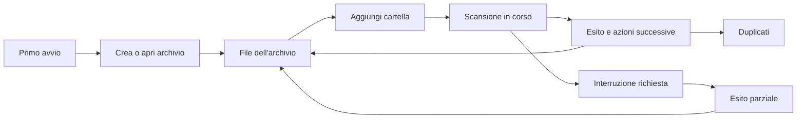

# dedup — Analisi UI/UX e proposta di redesign

Data: 13 settembre 2026. Stato: proposta, senza modifiche al frontend.

**Valutazione principale**

La priorità è rendere leggibile il ciclo di lavoro: scegliere cosa archiviare, vedere cosa sta succedendo, capire il risultato e ritrovare i file. L'interfaccia attuale dà molto spazio alla configurazione tecnica e poco all'avanzamento e agli esiti. Una veste moderna dovrebbe sostenere questo percorso con una gerarchia più chiara, controlli leggibili e meno elementi simultanei.

**Metodo e limiti**

Analisi delle due route, dello stato condiviso, dei componenti di scansione, workspace, navigazione, dettagli, statistiche e dei componenti UI comuni. Esaminati anche i contratti API, la configurazione della finestra e le operazioni backend che determinano il significato delle azioni e dei contatori.

Verifica visiva del frontend reale Svelte in Chromium tramite Playwright: finestra predefinita 1100×700 e minima 800×500; primo avvio, elenco file, dettagli, workspace, creazione workspace, scansione e statistiche. API Tauri simulate e dati di esempio; lo stato di avanzamento è stato impostato nel frontend. Non è un test della durata di una scansione reale né del comportamento della WebView nativa. Un errore di anteprima è stato simulato intenzionalmente. Non è stata eseguita una certificazione di accessibilità, una misura completa dei contrasti o un test con utenti.

Il grafo del codice è stato controllato in Tier 2, con generazione 2026-09-13T09:04:11Z e copertura dei file esaminati. La porzione CSS non coperta dal parser, riga 3 di app.css, è stata letta direttamente. I rilievi sotto distinguono osservazioni visive, riscontri nel codice e rischi da validare.

**Cosa mantenere**

- Un'azione principale per avviare una scansione e un controllo di annullamento già presenti.
- La base Svelte/Tailwind/DaisyUI e i componenti comuni: il redesign non richiede una migrazione di framework.
- Il dialog nativo con titolo accessibile, gestione di Escape e ripristino del focus.
- L'espansione su richiesta delle cartelle, la separazione tra navigazione e dettagli e i preset riutilizzabili.
- La coerenza cromatica generale del tema scuro. Il problema è soprattutto come vengono distribuiti enfasi, contrasto e spazio.

**1. Problemi e interventi, per priorità**

P0 = da affrontare nel primo intervento perché compromette comprensione o fiducia. P1 = flusso quotidiano. P2 = rifinitura o estensione.

| ID | Priorità | Riscontro | Effetto sull'utente | Miglioramento |
|---|---|---|---|---|
| UX01 | P0 | Durante la scansione, “Progress” inizia a y=810 nella finestra alta 700; il contenuto visibile termina a y=643. Verificato nel browser. | L'app sembra ferma sul pulsante “Scanning…”. | Sostituire il modulo con una vista di avanzamento, visibile senza scroll. |
| UX02 | P0 | `scanResult` viene salvato nello stato ma non visualizzato; dopo successo si torna alla home. Riscontro nel codice. | Non è chiaro cosa sia stato completato, saltato o archiviato. | Schermata finale persistente con risultato, esclusioni, eventuali errori e azioni successive. |
| UX03 | P0 | La riga selezionata sotto il puntatore ha testo scuro su fondo scuro; `hover:bg-base-200` compete con lo sfondo di selezione. Verificato dopo stabilizzazione delle transizioni. | Il file appena scelto diventa quasi illeggibile. | Definire esplicitamente tutti gli stati: normale, hover, selezionato, selezionato+hover e focus. |
| UX04 | P0 | “Saved” non specifica che si riferisce allo spazio nell'archivio; la scansione memorizza contenuti e metadati. | Si può credere di avere liberato spazio nella cartella sorgente. | Dichiarare che i file originali restano al loro posto e distinguere dimensione originale, dati archiviati e risparmio nell'archivio. |
| UX05 | P1 | Primo avvio: “Manage Workspaces”, poi elenco vuoto, poi creazione con nome, tag e percorso dello store. | Prima di ottenere un risultato bisogna capire il modello tecnico dell'app. | CTA diretta “Crea un archivio”, alternativa “Apri archivio esistente”; nome e destinazione, tag opzionali nelle impostazioni. |
| UX06 | P1 | Il modulo di scansione mostra subito percorso virtuale, quattro preset tecnici, regole salvate e regex. | L'operazione semplice appare complessa; lo spazio vuoto delle regole spinge giù i contenuti utili. | Vista iniziale con cartella sorgente e archivio di destinazione; esclusioni e organizzazione sotto “Opzioni avanzate”. |
| UX07 | P1 | La navigazione principale contiene solo Files e Stats; le copie sono elencate nei dettagli di un singolo file. | Per scoprire i duplicati bisogna cercarli manualmente. | Sezione “Duplicati” con gruppi, numero di copie, filtri e apertura dei percorsi. |
| UX08 | P1 | I duplicati sono un grande riquadro rosso di errore; le copie sono righe di testo non navigabili. | Un risultato atteso appare come un guasto e non offre un passo successivo chiaro. | Pannello neutro “2 percorsi, 1 contenuto archiviato” con collegamenti ai file. Riservare il rosso agli errori e alle azioni distruttive. |
| UX09 | P1 | Nell'albero non ci sono ricerca, ordinamento configurabile o breadcrumb; “+” avvia una scansione dentro una cartella virtuale. | Individuare un elemento richiede espansioni manuali; “+” non comunica l'effetto. | Ricerca, breadcrumb, lista ordinabile e azione esplicita “Aggiungi qui”. Albero come navigazione opzionale. |
| UX10 | P1 | Le statistiche della barra sommano i workspace; i dettagli riguardano quello attivo. I contatori del workspace vengono accumulati dopo le scansioni. | Numeri con significati diversi sembrano descrivere lo stesso archivio corrente. | Mostrare sempre l'ambito: archivio attivo, ultima scansione o totale globale. Usare uno snapshot dell'archivio per il suo inventario corrente. |
| UX11 | P1 | Errori di apertura, anteprima e caricamento dei dettagli finiscono in console; l'errore di anteprima simulato non produce un messaggio visibile. | Un clic senza esito sembra un altro blocco. | Stato locale “Anteprima non disponibile”, spiegazione breve, Riprova e dettagli tecnici espandibili. |
| UX12 | P1 | “Delete workspace” rimuove la voce dalla configurazione, senza cancellare lo store; la UI non spiega la distinzione. | L'utente non sa quali dati rischia di perdere o perché lo spazio su disco non cambia. | “Rimuovi dall'elenco”, testo “I dati dell'archivio restano sul disco” e possibilità di annullare la rimozione. |
| UX13 | P1 | Creazione workspace passa `loading={false}`; il cambio workspace non ha uno stato occupato dedicato. | Click ripetuti, attesa senza spiegazione e incertezza sull'azione corrente. | Busy state per operazione, prevenzione dei doppi invii e feedback sulla riga interessata. |
| UX14 | P1 | A 800×500 l'albero e i dettagli vengono impilati; nella fixture con due voci restano 332 px ai dettagli. | Il layout cambia in modo poco prevedibile e i dettagli richiedono molto scroll. | In modalità compatta, aprire l'ispettore come pannello alternativo con “Torna ai file”; conservare selezione e scroll. |
| UX15 | P1 | Testi secondari spesso da 11–12 px e a bassa opacità; controlli xs; albero senza `aria-expanded`; avanzamento senza regione di stato dedicata. | Lettura e orientamento da tastiera o con tecnologie assistive più difficili. | Tipografia più leggibile, focus esplicito, stato di espansione e annunci accessibili delle transizioni. Validare contrasto e bersagli interattivi. |
| UX16 | P2 | Il dettaglio privilegia schede separate per Size, Stored, Ratio e CID e un pulsante Open a tutta larghezza. | I metadati tecnici occupano lo spazio del contenuto e delle azioni utili. | Nome e percorso, anteprima, azioni contestuali e copie; metadati tecnici sotto un disclosure. |
| UX17 | P2 | Liste montate integralmente, immagini lette per intero e richieste dei dettagli senza verifica che la selezione sia ancora corrente. Riscontri statici, senza benchmark frontend. | Rischio di rallentamenti con molti elementi e di dettagli obsoleti dopo selezioni rapide. | Paginazione/virtualizzazione, anteprime limitate, cache e scarto delle risposte superate. Misurare su dataset rappresentativi. |
| UX18 | P1 | `StatsPage` carica al mount; il cambio workspace aggiorna la chiave dell'albero, non quella delle statistiche. Riscontro statico. | Possibile permanenza dei dati del precedente workspace nella vista Stats. | Caricamento legato all'identità del workspace e invalidazione delle richieste precedenti. |

Riferimenti nel codice: [pagina principale](../../app/src/routes/+page.svelte), [scansione](../../app/src/routes/scan/+page.svelte), [stato condiviso](../../app/src/lib/state/app.svelte.ts), [albero](../../app/src/lib/components/TreeNode.svelte), [dettagli](../../app/src/lib/components/FileDetails.svelte), [statistiche](../../app/src/lib/components/StatsPage.svelte), [workspace](../../app/src/lib/components/workspace/WorkspaceManagerDialog.svelte), [comandi backend](../../app/src-tauri/src/commands.rs).

**2. Modello di prodotto e terminologia**

Propongo di presentare dedup come un **archivio di file con deduplicazione automatica**. Questo è coerente con il comportamento attuale. Un'app per eliminare duplicati dai dischi sorgente richiederebbe funzionalità ulteriori e un diverso flusso di revisione e recupero.

| Oggi | Proposta | Motivo |
|---|---|---|
| Workspace | Archivio | Descrive ciò che l'utente crea e riapre. |
| Store path | Dove salvare l'archivio | Distingue destinazione e sorgente. |
| Scan | Aggiungi cartella | Nella CTA iniziale comunica il risultato; “scansione” resta lo stato operativo. |
| Virtual path | Cartella nell'archivio | Con scelta visuale e valore predefinito. |
| Saved | Spazio risparmiato nell'archivio | Evita promesse di spazio liberato sulla sorgente. |
| Import Existing | Apri archivio esistente | Riutilizzare uno store e importare configurazioni sono azioni diverse. |
| Delete workspace | Rimuovi dall'elenco | Rispecchia l'operazione implementata. |
| CID | Identificatore del contenuto | Disponibile nei dettagli avanzati, con copia completa. |

Gli esempi sono in italiano per questa proposta. La UI dovrebbe adottare una lingua coerente, con date e numeri localizzati. La localizzazione completa può arrivare dopo la revisione dei flussi.

**3. Struttura proposta**

Shell stabile con selettore dell'archivio, navigazione **File · Duplicati · Attività** e un'unica CTA principale **Aggiungi cartella**. Le statistiche diventano un riepilogo dell'archivio, con accesso agli approfondimenti; non serve imporre una dashboard iniziale a ogni apertura. Impostazioni e gestione avanzata vanno nel menu dell'archivio.

La prima versione di Attività può contenere la scansione corrente e il suo ultimo esito. Uno storico persistente, riapertura dopo riavvio e notifiche in background richiedono un modello di job nel backend; non vanno promessi con il solo stato in memoria del frontend.



**4. Scansione: il primo redesign da realizzare**

Configurazione breve: cartella da aggiungere, archivio scelto e destinazione interna facoltativa. Mostrare “I file originali rimangono al loro posto”. In “Opzioni avanzate” inserire esclusioni, raggruppamento delle cartelle tecniche e regole personalizzate. Non attivare nuove esclusioni silenziosamente; presentare chiaramente ciò che verrà ignorato.

All'avvio il modulo lascia posto all'attività corrente. Spostare il focus sul titolo della nuova vista. Esempio di contenuto, non di telemetria già disponibile:

```text
Scansione in corso
Archivio fotografie ← /home/utente/Foto

Elaborazione dei file
3.400 file elaborati       4,1 GB letti
920 copie individuate     23 file esclusi

File corrente: vacanze/foto-003400.jpg
Tempo trascorso: 02:14

[Interrompi scansione]                 [Dettagli]
```

Stati espliciti: preparazione, elaborazione, finalizzazione, completata, completata con problemi, interruzione richiesta, interrotta, fallita. Nell'API attuale mancano fase, totale, timestamp dell'ultimo segnale e conteggio dettagliato degli errori: per dichiarare questi stati con precisione servono eventi backend aggiuntivi.

Se il totale non è noto, mostrare contatori e indicatore indeterminato, senza percentuali inventate. Tempo trascorso e ultimo aggiornamento ricevuto sono derivabili lato UI; velocità ed ETA richiedono campionamento e stime dichiarate. “Nessun aggiornamento ricevuto da 20 secondi” non equivale a “app bloccata”: potrebbe esserci un file grande in elaborazione. Un heartbeat del backend permetterebbe di distinguere meglio le condizioni.

Durante l'interruzione mostrare “Interruzione in corso…”, mantenendo l'ultimo avanzamento. L'esito deve dire se sono stati conservati contenuti parziali; non suggerire un rollback che il backend non garantisce. Pausa/riprendi è una futura funzione backend, diversa dall'annullamento già disponibile.

Alla fine mantenere un riepilogo: elementi elaborati, saltati, copie individuate, dimensioni chiaramente definite, eventuale log degli errori. Azioni “Apri file” e “Vedi duplicati”. Evitare il ritorno automatico a una schermata senza spiegazione.

Consentire di navigare durante una scansione va introdotto solo dopo avere reso esplicita la disponibilità delle letture: oggi il backend prende lo Store dallo stato durante l'elaborazione. Una shell navigabile non basta a garantire che i dati siano interrogabili.

**5. File e duplicati**

La vista File dovrebbe usare lo spazio centrale per una lista con colonne Nome, Dimensione, Modificato e Copie. A sinistra si può mantenere l'albero delle cartelle; l'ispettore a destra compare soltanto con una selezione. Su finestre piccole l'ispettore sostituisce temporaneamente la lista. Breadcrumb e ricerca devono rimanere visibili.

Per contenere lo scope, iniziare con filtro nella cartella corrente e dichiararlo. La ricerca globale nell'archivio richiede una API adatta. Le grandi liste devono poter essere paginate o virtualizzate, preservando navigazione da tastiera e focus.

La vista Duplicati mostra gruppi di contenuto identico, numero di percorsi e dimensione logica. Le copie devono essere apribili nell'archivio. La API per tutti i gruppi esiste già, ma per ordinamento per dimensione, grandi insiemi e paginazione è preferibile un endpoint che restituisca dati aggregati, evitando una richiesta per file.

Non introdurre una CTA “Libera spazio” finché non esiste una funzione di eliminazione dei file sorgente con semantica, anteprima e recupero definiti. “N copie” e “N contenuti fisicamente memorizzati” sono concetti distinti.

**6. Workspace e avvio**

Primo avvio con due scelte: Crea un archivio e Apri archivio esistente. Per la creazione chiedere nome e destinazione; suggerire un nome dal percorso e lasciare i tag nelle opzioni. Esplicitare che l'archivio occupa spazio sul disco di destinazione. Dopo la creazione, attivare l'archivio e offrire subito Aggiungi cartella.

Per l'uso quotidiano, selettore rapido dell'archivio corrente. Gestione separata con percorso, disponibilità del disco e ultima attività. Import/export della configurazione nel menu avanzato: importare un JSON non significa importare i contenuti.

Ridurre a una CTA primaria per stato. Il dialog attuale mette Import Existing e New Workspace sullo stesso piano. La rimozione dall'elenco va nel menu della riga, con spiegazione e undo; un'eventuale cancellazione fisica futura deve essere un'azione separata.

**7. Direzione visiva**

Proposta: applicazione desktop sobria, con superfici neutre, contrasto leggibile e accento blu. Mantenere DaisyUI, definendo token e varianti coerenti invece di distribuire correzioni ad hoc nei componenti.

| Elemento | Direzione proposta |
|---|---|
| Tipografia | Testo operativo 14–16 px; titoli di pagina 20–24 px; testo secondario leggibile, senza affidarsi sistematicamente a opacità 50%. Monospace per percorsi e identificatori. |
| Spaziatura | Scala 4/8/12/16/24 px; densità compatta nelle liste, più respiro nei moduli. |
| Controlli | Altezza indicativa 36–40 px; icone con bersagli adeguati e nomi accessibili. |
| Superfici | Pochi livelli, bordi discreti e raggi coerenti 8–12 px. Ridurre le schede annidate e i contenitori per singoli metadati. |
| Colore | Blu per azione e selezione; verde per completamento; ambra per esclusioni/problemi recuperabili; rosso per errori e distruzione. Duplicati in tono neutro. |
| Icone | Un unico set coerente per cartella, file, ricerca, attività e menu. Sostituire “+”, “x” e marcatori testuali dove la funzione non è evidente. |
| Movimento | Transizioni brevi per cambio stato, nessuna animazione per ogni file processato; rispettare la preferenza di movimento ridotto. |
| Tema | Rifinire prima il tema attuale; aggiungere chiaro/scuro/sistema in un secondo passaggio, validando gli stessi stati in entrambi. |

L'ispettore deve usare righe etichetta/valore per i metadati secondari. L'azione Open non ha bisogno di occupare tutta la larghezza; nome, contenuto e percorsi duplicati meritano più risalto. Le statistiche per estensione funzionano meglio come tabella ordinabile con barre discrete e filtri che conducono ai file interessati.

**8. Accessibilità, feedback e robustezza**

Obiettivo di progetto: WCAG 2.2 AA, con verifica effettiva successiva. I messaggi di stato devono essere comunicabili alle tecnologie assistive senza spostare il focus; usare una regione di stato per transizioni e riepiloghi, evitando di annunciare ogni file. Riferimento: [W3C — Status Messages](https://www.w3.org/WAI/WCAG22/Understanding/status-messages).

Controllare focus visibile, uso da tastiera, contrasto del testo e bersagli dei controlli; il requisito AA sui bersagli considera 24×24 CSS px o le eccezioni previste, mentre 36–40 px è qui una scelta di design più comoda. Riferimento: [WCAG 2.2](https://www.w3.org/TR/WCAG22/).

L'albero va reso un vero tree navigabile da tastiera oppure presentato come normale elenco espandibile con semantica corretta. Aggiungere `aria-expanded` e annunciare cartelle in caricamento. Gli hint e gli errori dei campi vanno associati programmaticamente ai controlli, oltre alle etichette visibili già presenti.

Prevedere sempre quattro esiti per i pannelli dati: caricamento, contenuto, vuoto reale ed errore. Un archivio non raggiungibile non deve sembrare un archivio vuoto. Conservare i dati validi durante un refresh, indicando l'aggiornamento; scartare risposte riferite a un file o workspace non più selezionato.

**9. Roadmap proposta e dipendenze**

| Fase | Interventi | Dipendenze | Criterio di completamento |
|---|---|---|---|
| 1 — Chiarezza immediata | Vista scansione dedicata, riepilogo finale, errori visibili, contrasto selezione, etichette Saved/Delete, eliminazione dell'enfasi rossa sui duplicati. | In gran parte frontend; usare solo contatori realmente disponibili. | A 800×500 stato e interruzione sono sempre visibili; ogni scansione termina con un esito leggibile. |
| 2 — Flussi semplici | Primo avvio diretto, selettore archivio, opzioni avanzate, lista file con breadcrumb, dettagli compatti, vista Duplicati iniziale. | API gruppi esistente; definire ambito della ricerca e aggiornamento dati. | Un nuovo utente riesce ad aggiungere una cartella senza configurare regex o percorsi virtuali. |
| 3 — Affidabilità dei dati | Snapshot delle statistiche, invalidazione per workspace, job e log strutturati, heartbeat, gestione coerente dei risultati parziali. | Backend e contratti IPC. | Contatori ripetibili e coerenti con l'archivio; nessun dato del workspace precedente dopo il cambio. |
| 4 — Scala e rifinitura | Paginazione/virtualizzazione, anteprime leggere, storico persistente, temi, scorciatoie e verifica accessibilità. | Endpoint per grandi dataset e persistenza job dove necessaria. | Liste grandi, finestre compatte e navigazione da tastiera rimangono utilizzabili. |

Non tutte le voci della fase 3 devono aspettare la fine della 2: correggere presto i numeri fuorvianti e l'invalidazione dei dati. La separazione indica dipendenze e portata, non settimane di calendario.

**10. Verifica del redesign**

- Scansione da 1100×700 e 800×500: titolo, stato, contatori principali e Interrompi visibili senza scroll.
- Avvio senza aggiornamenti, elaborazione con aggiornamenti, file grande, completamento, errori parziali e interruzione: ogni stato ha un messaggio distinto e veritiero.
- Selezione normale, hover, focus e hover su selezione: leggibilità in ogni combinazione.
- Primo avvio: un piccolo test con utenti non esperti verifica che siano chiari sorgente, destinazione e conservazione degli originali.
- Cambio rapido di file/workspace e richieste fuori ordine: nessun dettaglio o statistica della selezione precedente.
- Lettura fallita, archivio scollegato e anteprima non disponibile: errore locale e possibilità di riprovare.
- Dataset da 100, 10.000 e 100.000 elementi: misurare latenza di interazione, quantità di DOM e memoria; definire il budget su una macchina di riferimento prima di dichiarare un miglioramento.
- Tastiera, focus del dialog, zoom del testo e nomi accessibili; controllo automatico più verifica manuale delle operazioni principali.

**Evidenze visive**

Le schermate usano dati simulati e rappresentano la UI attuale, non il redesign:

- [Scansione: avanzamento fuori vista](ui-ux-assets/scanning-1100.png)
- [Scansione dopo lo scroll](ui-ux-assets/scanning-scrolled-1100.png)
- [Dettagli e selezione sotto il puntatore](ui-ux-assets/details-1100.png)
- [Finestra minima 800×500](ui-ux-assets/details-800.png)
- [Gestione workspace](ui-ux-assets/workspaces-1100.png)
- [Creazione workspace](ui-ux-assets/new-workspace-1100.png)
- [Statistiche](ui-ux-assets/stats-1100.png)
- [Primo avvio](ui-ux-assets/first-run-1100.png)

Il primo intervento raccomandato è il flusso completo **configurazione breve → scansione visibile → riepilogo**, insieme alla correzione del contrasto e del significato dei contatori. È il cambiamento più direttamente collegato alla sensazione di blocco segnalata.
